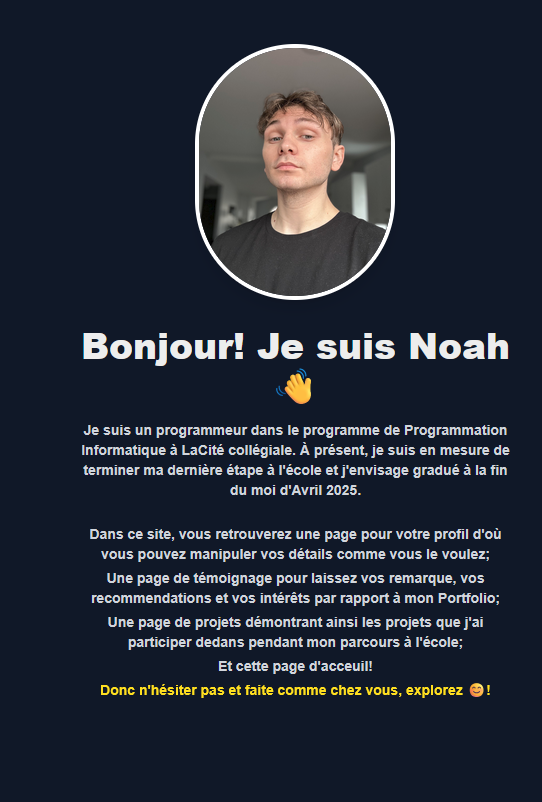
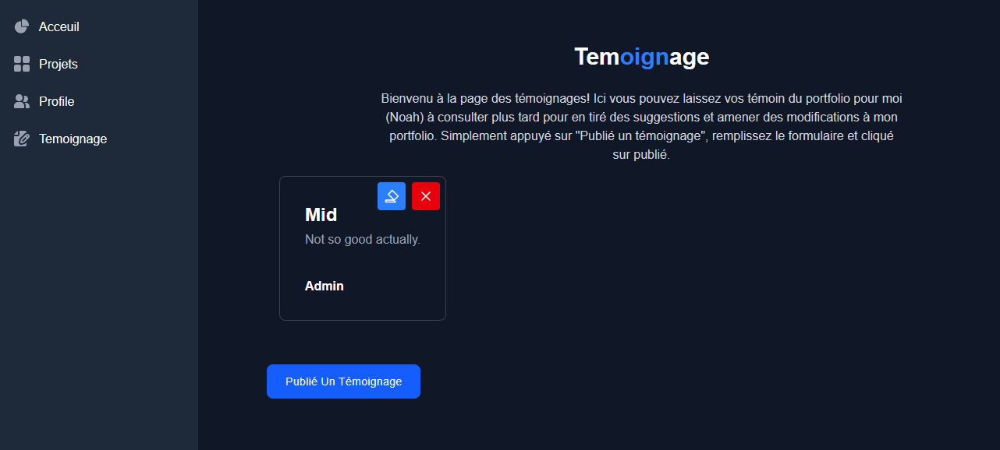
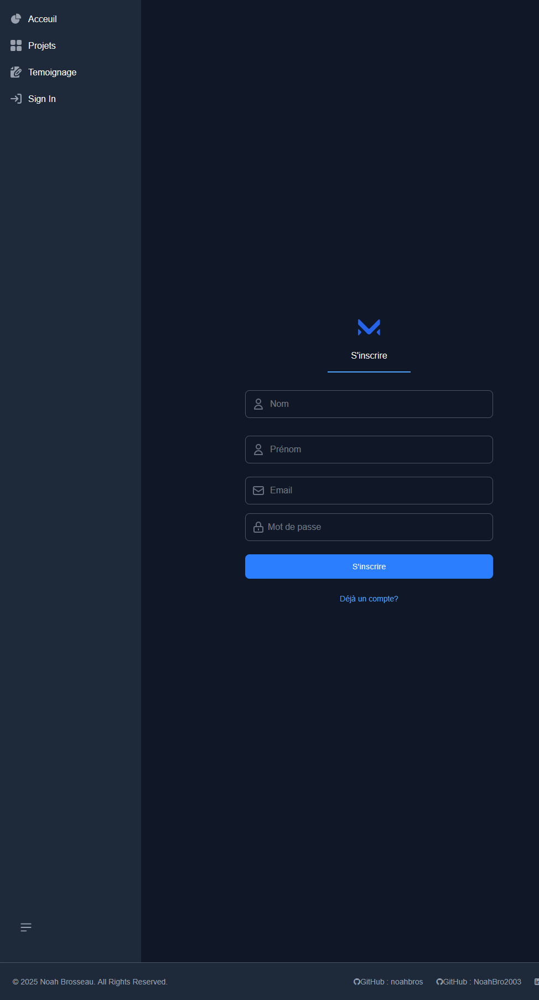

# Portfolio
Le portfolio de Noah Brosseau pour son évaluation de sa troisième unité de sa classe "Programmation Web Avancé".

Pour être capable d'accéder le Portfolio il nécessite que vous utiliser XAMPP. Suivre ces étapes pour lancer le projet.
1. Clone le repo sur votre ordinateur.
2. Ouvrer le projet dans VSCode.
3. Ouvrer 2 terminaux.
4. Sur un des terminaux naviguer avec "cd" dans le Backend. (devrait seulement être /Projet/Backend/)
5. Dans le second terminaux naviguer avec "cd" dans le Frontend. (devrait être /Projet/Frontend/portfolionb/)
6. Effectuer la commande "npm i" dans les deux terminaux.

7. Lancer XAMPP
8. Activer "Apache" et "MySQL"
9. Cliqué sur "Admin" pour "MySQL"
10. Créer une BDD nommé "portfolio"

11. Retourner sur les terminaux et lancer "npm start" pour le backend, et "npm run dev" pour le frontend.
12. Cliqué sur le lien que le terminaux du frontend vous donne.
 

